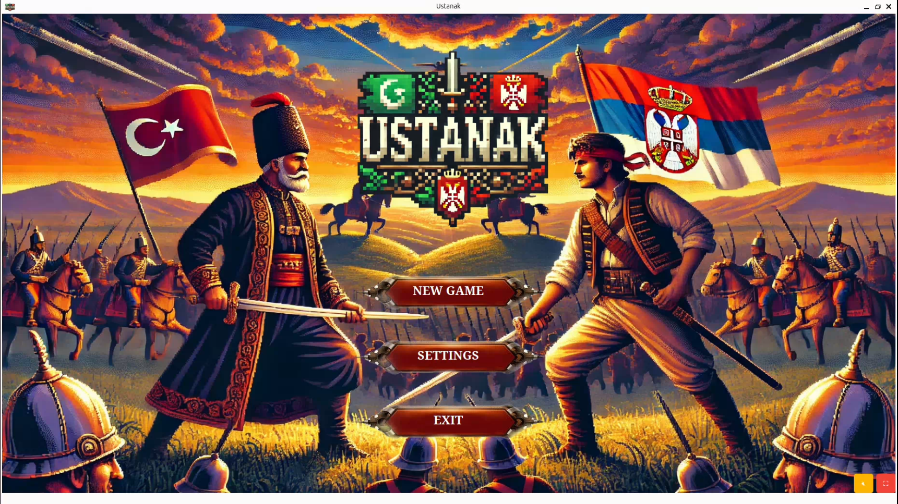
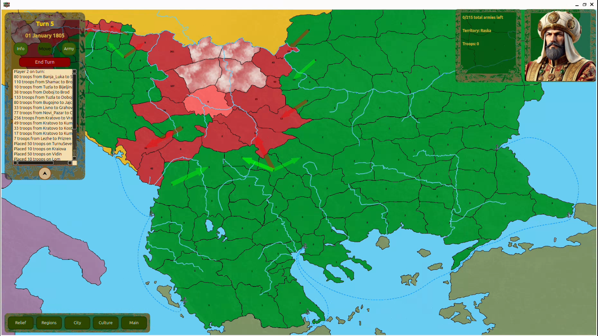
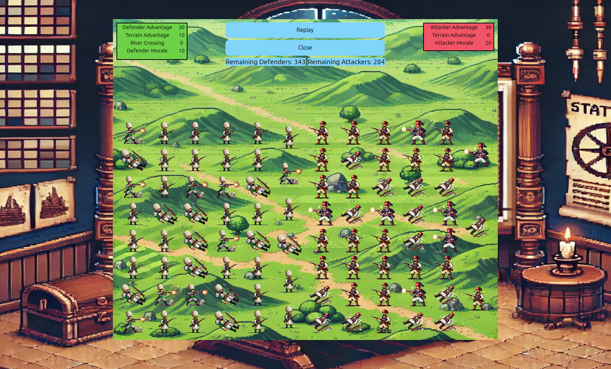
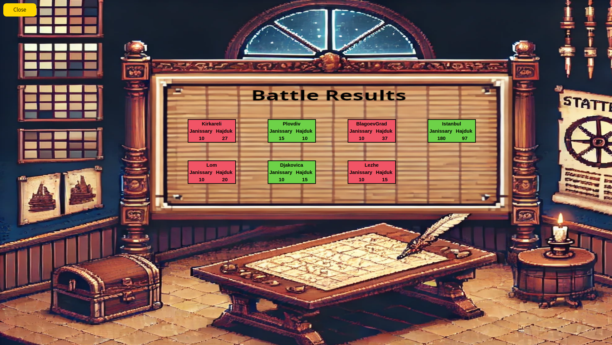
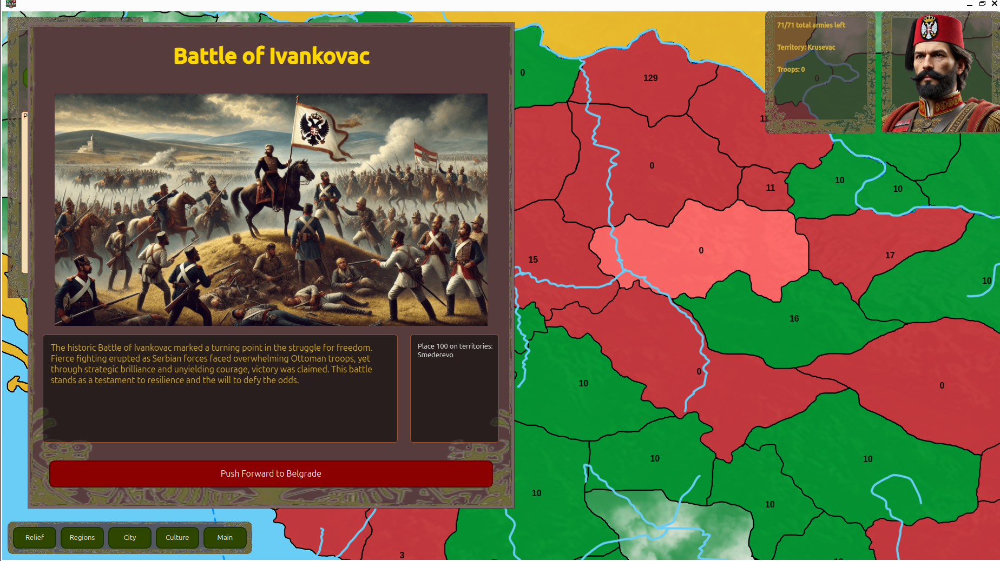

# Ustanak

**Ustanak** is a turn-based strategy game set during the historical period of the First Serbian Uprising (1804–1813). The game immerses players into the dramatic conflict between Serbian rebels (Hajduks) and the Ottoman Empire. Players must manage territories, command armies, and make tactical decisions to claim victory in this pivotal moment of history.

---

<p align="center">
  
  
</p>

<p align="center">
  
  
  
>>>>>>> ed0e801386852a6f1202d70fbf6f74b1b8e161f1
</p>

## Features

- Historical Setting: Experience the challenges and strategies of the First Serbian Uprising. Fight to liberate territories from Ottoman control or defend the empire's stronghold.
- Territory Management: Command armies stationed on various territories. Reinforce positions, attack enemy regions, and strategically maneuver forces to gain the upper hand.
- Turn-Based Gameplay: Take turns with your opponent, planning and executing moves with precision and strategy.
- Dynamic Map: A visually engaging map displays territories, troop placements, and movement options.

---

## Gameplay

In **Ustanak**, each territory on the map is populated with a specific number of troops, and players must strategically manage their armies to conquer or defend regions. The ultimate goal is to control all territories or achieve other victory conditions set at the start of the game. Success relies on a combination of military strength, strategic troop placement, and effective management of your armies, recruits and events.


### How to Play

1. **Select a Territory**  
   Choose a territory under your control to take action.

2. **Troop Management**  
   You can either transfer troops to adjacent regions or launch attacks on enemy territories. The outcome of battles depends on a variety of factors such as troop numbers, morale, and terrain advantages.

3. **Recruitment**  
   After each turn, you have the opportunity to recruit new troops based on your city’s **culture** and **level**. Cities with higher levels and stronger cultural influence can recruit more units, giving you an advantage as you expand your empire.

4. **Strategic Battle Planning**  
   Use strategic planning to outmaneuver your opponent. Morale plays a crucial role in determining the effectiveness of your troops in battle. High morale can lead to better performance, while low morale may cause troops to perform poorly. Additionally, certain types of terrain provide advantages, influencing the results of combat.

5. **Battle Results & Replay**  
   Once a battle concludes, you can view the **Battle Results** in the corresponding dialog. Here, you will be presented with a summary of the outcome, including the number of troops that participated in the battle and which territory the battle took place in. Additionally, you'll find other key statistics, such as the number of casualties and the morale effects on both sides if you click on that battle. If you're interested in seeing the battle unfold again, you can simulate the battle's replay by clicking on play button in the **Battle Replay** window.

---

## Requirements

Before building the project, ensure you have the following tools and libraries installed:

- **CMake** (version 3.16 or later).
- **Ninja** build system.
- **Qt 6.6.3**, with these components:
  - Qt Base Development (`qt6-base-dev`)
  - Qt Multimedia Development (`qt6-multimedia-dev`)
- **g++** for compiling C++ code.
- **Git** for cloning the repository.

---

## Build Instructions

### Using Qt Creator

1. Download and install **Qt for Open Source Development** from [qt.io](https://www.qt.io/).  
   During installation, choose **Custom installation** and include the following components:
   - **Qt 6.6.3**
   - **Qt Multimedia**
   - **Qt Creator**
   - **CMake**
   - **Ninja**

2. Clone the repository:
```bash
   git clone https://gitlab.com/matf-bg-ac-rs/course-rs/projects-2024-2025/Ustanak.git
   cd ./Ustanak
```
3. Open Qt Creator and load the project:

- Click on Open Project.
- Navigate to the project folder and select CMakeLists.txt.

4. Press the Run button in the bottom-left corner to build and launch the game.

### Using CMake Without Qt Creator (Linux)

1. Install the required dependencies:
```bash
    sudo apt-get install git cmake ninja-build g++ qt6-base-dev qt6-multimedia-dev
```
2. Clone the repository:
```bash
    git clone https://gitlab.com/matf-bg-ac-rs/course-rs/projects-2024-2025/Ustanak.git
    cd ./Ustanak
```
3. Build the project:
```bash
    cmake -G Ninja -B build/ -S ./
    ninja -C build/
```
4. Run the game:
```bash
    cd build/
    ./Ustanak
```

---

## Team members:
 - <a href="https://gitlab.com/nikolalabus.labus02">Nikola Labus 094/2020</a>
 - <a href="https://gitlab.com/dobrosavljevicnenad">Nenad Dobrosavljevic 088/2020</a>
 - <a href="https://gitlab.com/krki77">Nikola Krstajic 174/2020</a>
 - <a href="https://gitlab.com/Dejan43">Dejan Dragojlovic 122/2020</a>
 - <a href="https://gitlab.com/zpantovic">Zagorka Pantovic 227/2020</a>
